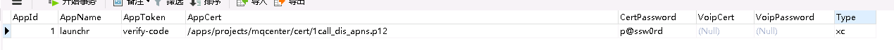

简化部署方案
========

使用Docker Compose 快速部署和管理多个容器应用。

compose里有工程和服务的概念，一个工程包含多个服务。

使用compose管理时记得要把路径切换到im工程根目录下，才能执行docker-compose命令，当然，也可以用docker的相关命令。

当有服务发生变动时，比如替换了jar包配置文件，需要重新build镜像，然后重新启动。
```
$ docker-compose build 服务名
$ docker-compose up -d 
```

# 部署流程

**1. 制作工程配置目录**

形同docker-im目录，创建属于自己的配置目录,放/apps下，根据不同的环境对配置进行相应改动，compose据此来部署一系列容器

注：可以把这一整个工程拆成两个，一个是存储的，包含mysql,rabbitmq,redis，一个是im的，包含api,mq,ws,这样可以分开部署了。

```text
docker-im                工程根目录
├── docker-compose.yml   compose配置文件，定义需要部署的各种服务
├── api
    ├── application.yml
    ├── Dockerfile
    └── im-api-0.0.1-exec.jar
├── mq
    ├── application.yml
    ├── Dockerfile
    └── mqcenter-1.0.0-exec.jar
├── ws
    ├── config-extend.yml
    ├── Dockerfile
    └── im-ws-0.0.1-exec.jar
├── mysql
    ├── config-file.cnf
    └── Dockerfile
├── rabbitmq
    └── Dockerfile
└── redis
    ├── Dockerfile    
    └── redis.conf
```

**2. 初始化准备**

```
$ mkdir -p /apps/projects/launchrAttachment
$ mkdir -p /apps/projects/logs
$ mkdir -p /apps/projects/mqcenter/cert
```

然后放推送证书到cert下

**3. build**

```
$ cd /apps/docker-im 
$ docker-compose up -d
```

服务会被生成并以容器形式启动，这时候会因为mysql里没有im数据库导致api,mq一直出错重启，创建下数据库就好了

**4. 数据库创建**

复制im数据库结构,导入到mysql服务器中。

初始化appinfo 表,具体内容根据环境来改



**5. rabbitmq添加管理员**

```
$ docker exec -it rabbitmq-ct bash
```

进入容器内部执行
```
rabbitmqctl add_user monitor Y7I7VyZ9M6J2U3f
rabbitmqctl set_user_tags monitor monitoring
rabbitmqctl set_permissions -p / monitor "." "." ".*"
rabbitmqctl add_user mintcode 123456
rabbitmqctl set_user_tags mintcode administrator
rabbitmqctl set_permissions -p / mintcode "." "." ".*"
rabbitmqctl delete_user guest
rabbitmqctl list_users
```

**6.完成后检查**

```
$ docker-compose ps 显示所有服务
```

**7.docker-compose相关命令**

```
Define and run multi-container applications with Docker.

Usage:
  docker-compose [-f <arg>...] [options] [COMMAND] [ARGS...]
  docker-compose -h|--help

Options:
  -f, --file FILE             Specify an alternate compose file (default: docker-compose.yml)
  -p, --project-name NAME     Specify an alternate project name (default: directory name)
  --verbose                   Show more output
  -v, --version               Print version and exit
  -H, --host HOST             Daemon socket to connect to

  --tls                       Use TLS; implied by --tlsverify
  --tlscacert CA_PATH         Trust certs signed only by this CA
  --tlscert CLIENT_CERT_PATH  Path to TLS certificate file
  --tlskey TLS_KEY_PATH       Path to TLS key file
  --tlsverify                 Use TLS and verify the remote
  --skip-hostname-check       Don't check the daemon's hostname against the name specified
                              in the client certificate (for example if your docker host
                              is an IP address)

Commands:
  build              Build or rebuild services
  config             Validate and view the compose file
  create             Create services
  down               Stop and remove containers, networks, images, and volumes
  events             Receive real time events from containers
  exec               Execute a command in a running container
  help               Get help on a command
  kill               Kill containers
  logs               View output from containers
  pause              Pause services
  port               Print the public port for a port binding
  ps                 List containers
  pull               Pulls service images
  restart            Restart services
  rm                 Remove stopped containers
  run                Run a one-off command
  scale              Set number of containers for a service
  start              Start services
  stop               Stop services
  unpause            Unpause services
  up                 Create and start containers
  version            Show the Docker-Compose version information

```